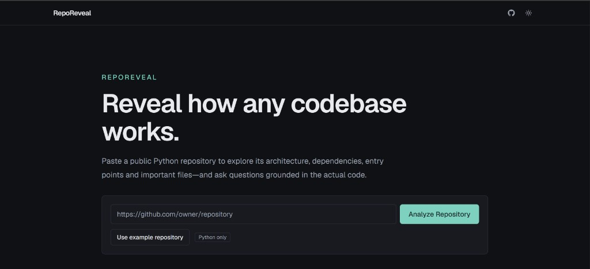
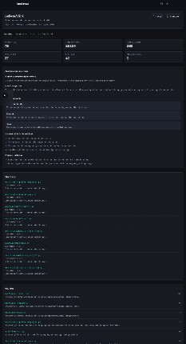

# RepoReveal

**Reveal how any codebase works.**

RepoReveal helps developers understand unfamiliar public Python GitHub repositories. Paste a repository URL and RepoReveal safely downloads the source, analyzes it without executing anything, builds a file-level dependency graph, detects entry points, ranks important files, and optionally answers grounded questions with validated citations.

## Screenshots

### Landing page



### Analysis overview



## Features

- Public GitHub repository analysis (Python only)
- Safe archive download and extraction with resource limits
- AST-based static analysis (no code execution)
- File-level dependency graph with React Flow
- Entry-point detection with explainable reasons
- Importance ranking and “start here” reading order
- Structural change-impact traversal (depth 2)
- Hybrid retrieval + grounded LLM overview / Q&A / file explanations
- Works without an OpenAI key (deterministic features remain available)
- PostgreSQL persistence with commit-SHA analysis caching
- Docker Compose local development
- Automated backend and frontend tests + GitHub Actions CI

## Architecture

```text
┌────────────┐     ┌────────────┐     ┌─────────────────────┐
│  Next.js   │────▶│  FastAPI   │────▶│ PostgreSQL+pgvector │
│  frontend  │     │  backend   │     │                     │
└────────────┘     └─────┬──────┘     └─────────────────────┘
                         │
                         ▼
                 GitHub API (public)
```

See [docs/architecture.md](docs/architecture.md), [docs/analysis-engine.md](docs/analysis-engine.md), and [docs/ai-retrieval.md](docs/ai-retrieval.md).

## Analysis flow

1. Validate `https://github.com/owner/repo`
2. Fetch metadata + default-branch commit SHA
3. Reuse cached analysis when available
4. Download and safely extract the commit tarball
5. Scan / parse / resolve imports / build graph
6. Detect entry points, classify files, score importance
7. Chunk code for retrieval
8. Optionally embed + generate AI overview
9. Poll until complete and explore results

**RepoReveal analyzes source text only. It never executes repository code.**

## AI retrieval flow

Query → local term extraction → keyword + vector candidates → graph-neighbor expansion → rerank → bounded context → structured answer → citation validation.

## Technology stack

| Area | Stack |
|---|---|
| Frontend | Next.js (App Router), React, TypeScript, Tailwind, TanStack Query, React Flow, Dagre, Zod, Vitest |
| Backend | Python 3.12+, FastAPI, Pydantic v2, SQLAlchemy 2, Alembic, NetworkX, OpenAI SDK, Pytest, Ruff, Mypy |
| Data | PostgreSQL 16 + pgvector |
| Infra | Docker Compose, GitHub Actions |

## Local setup

### Prerequisites

- Docker + Docker Compose
- Or: Python 3.12+, Node.js 22+, local PostgreSQL with pgvector

### Docker Compose (recommended)

```powershell
Copy-Item .env.example .env
# Optional: set OPENAI_API_KEY and GITHUB_TOKEN in .env
docker compose up --build
```

- Frontend: http://localhost:3000
- Backend health: http://localhost:8000/api/v1/health

```powershell
docker compose down
docker compose exec backend alembic upgrade head
docker compose exec backend pytest
docker compose exec frontend npm test
```

### Backend (without Compose frontend)

```powershell
cd backend
python -m venv .venv
.\.venv\Scripts\Activate.ps1
pip install -e ".[dev]"
# Ensure DATABASE_URL points at Postgres with pgvector
alembic upgrade head
uvicorn app.main:app --reload --port 8000
```

### Frontend

```powershell
cd frontend
npm install
$env:NEXT_PUBLIC_API_BASE_URL="http://localhost:8000/api/v1"
npm run dev
```

## Environment variables

See [`.env.example`](.env.example). Important keys:

| Variable | Purpose |
|---|---|
| `DATABASE_URL` | Async SQLAlchemy URL (`postgresql+asyncpg://...`) |
| `GITHUB_TOKEN` | Optional; improves GitHub rate limits |
| `OPENAI_API_KEY` | Optional; enables AI overview / explain / ask |
| `AI_ENABLED` | Toggle AI features |
| `OPENAI_CHAT_MODEL` / `OPENAI_EMBEDDING_MODEL` | Central model config |
| `MAX_*` / `ANALYSIS_TIMEOUT_SECONDS` | Safety limits |
| `NEXT_PUBLIC_API_BASE_URL` | Frontend → API base |
| `NEXT_PUBLIC_DEMO_REPOSITORY_URL` | Example repository button |

## Database migrations

```powershell
docker compose exec backend alembic upgrade head
# or locally:
cd backend
alembic upgrade head
alembic revision --autogenerate -m "message"
```

## Testing

```powershell
# Backend
cd backend
.\.venv\Scripts\pytest -q
ruff check .
ruff format --check .
mypy app

# Frontend
cd frontend
npm test
npm run lint
npm run typecheck
npm run build
```

Core tests mock external APIs and do not require GitHub or OpenAI credentials.

## Security model

- Only validated `github.com/{owner}/{repo}` URLs are accepted
- GitHub API requests are constructed server-side (no arbitrary user URLs)
- Archive extraction rejects path traversal, absolute paths, and symlinks
- Size / file-count / timeout limits protect the process
- Analyzed code is never executed, imported, or installed
- OpenAI keys stay on the backend

## Current limitations

- Public repositories only
- Python only
- Default branch only
- Static import resolution (dynamic imports are unresolved)
- FastAPI background tasks can be lost on process restart
- Not a production multi-tenant platform

## Future ideas

- Branch picker
- Additional languages
- Durable job queue
- Richer call-graph approximations
- Exportable architecture reports

## Demo fixture

`examples/demo_repository/` is a small FastAPI-style Python package used for deterministic analyzer tests.

## License

MIT (or your preferred license).
